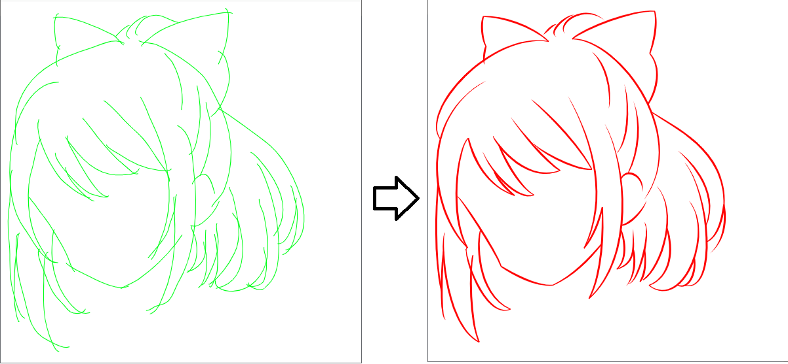
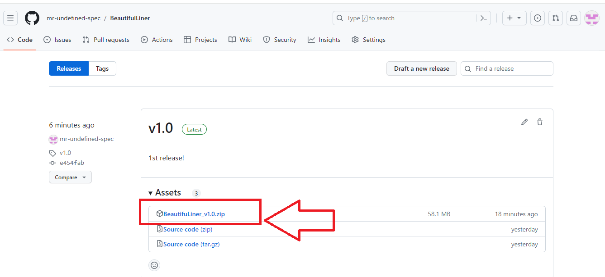
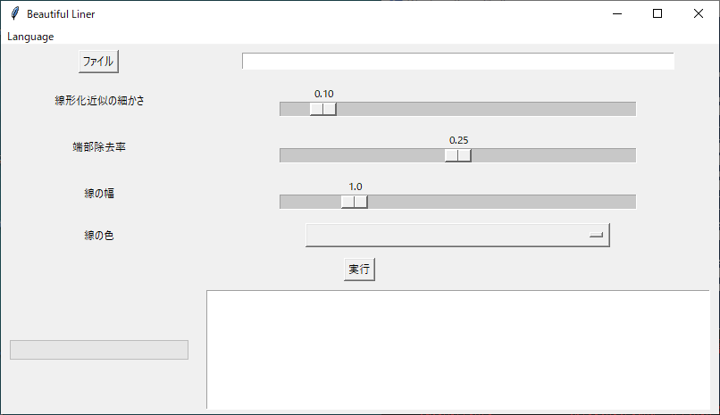
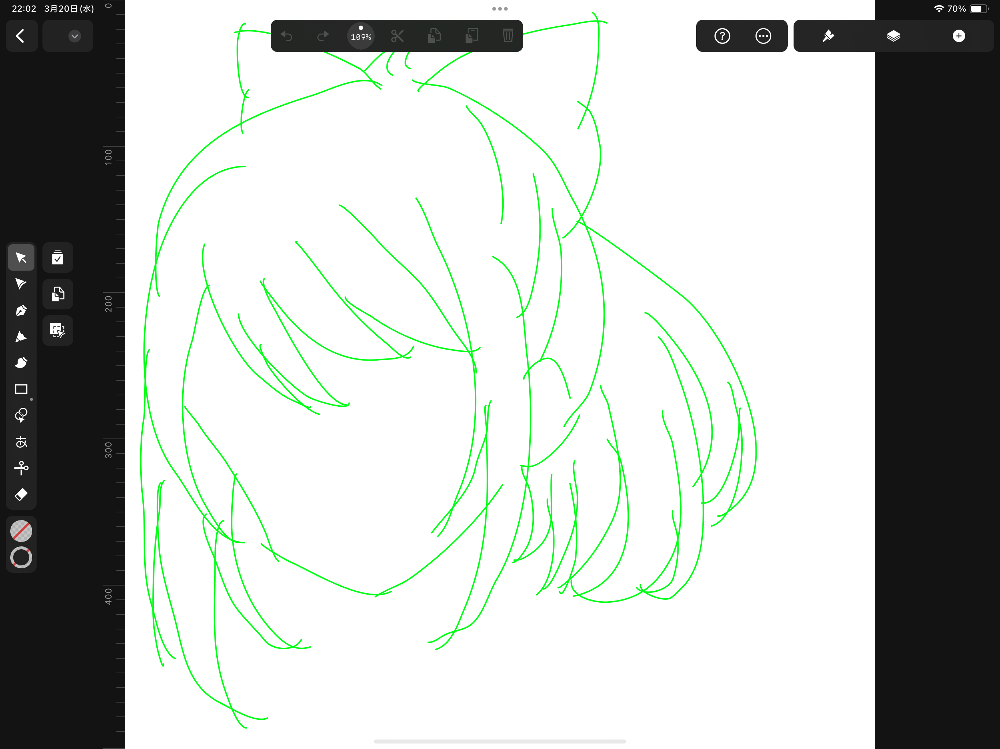
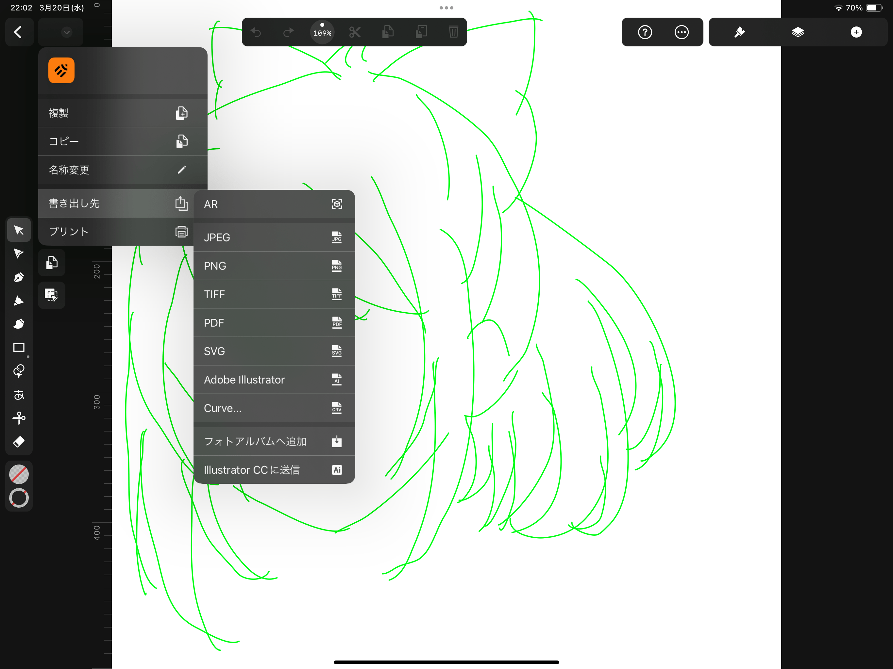
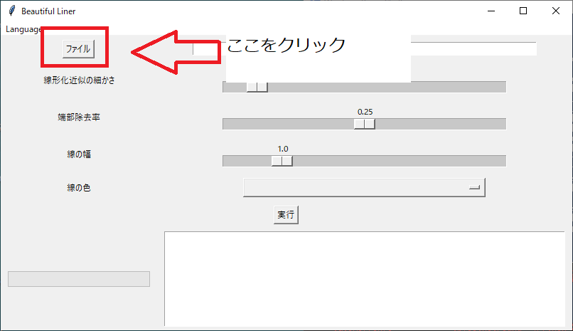
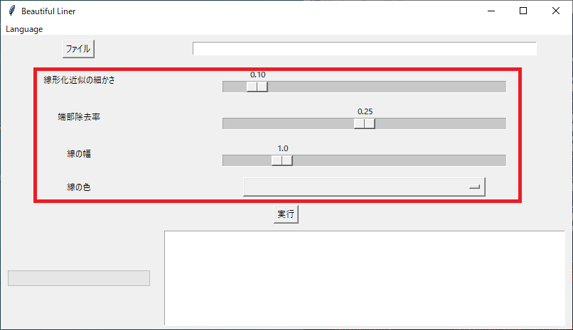
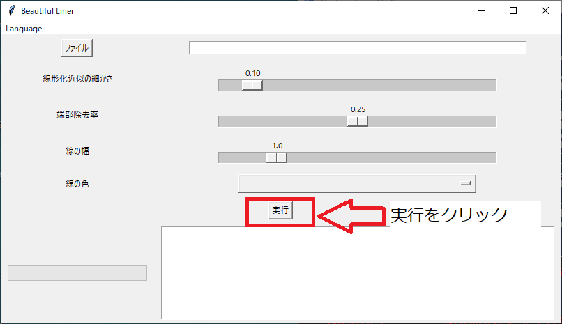
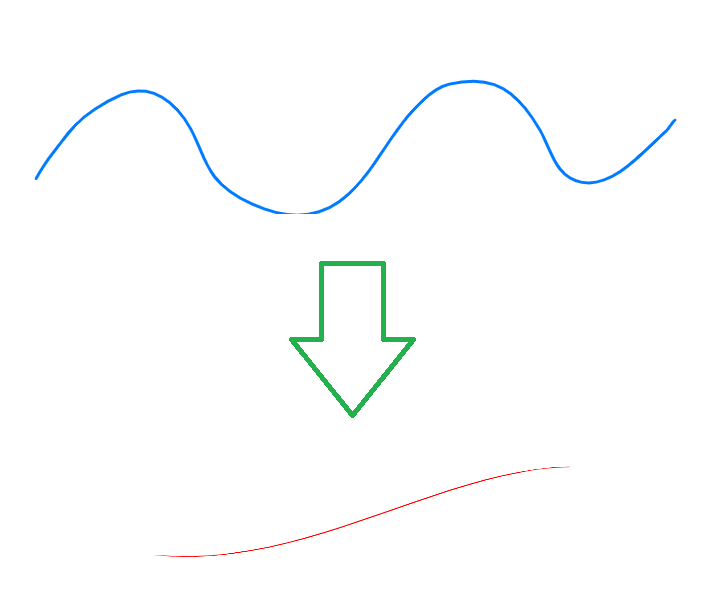
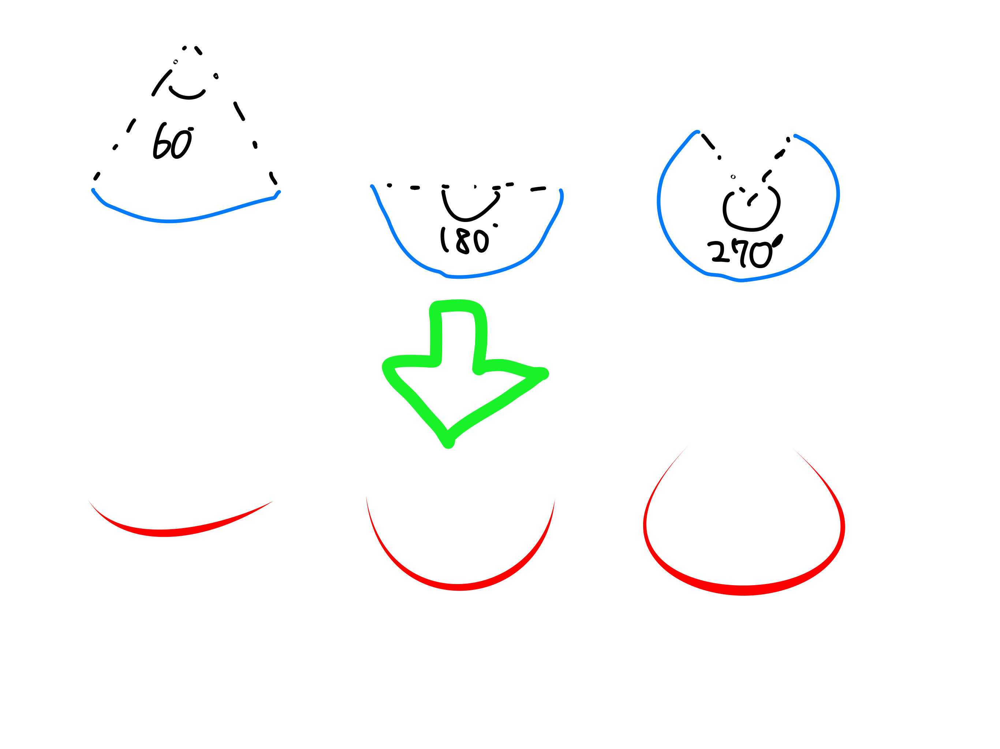

# BeautifulLiner
BeautifulLinerはiPadアプリの"Linearity Curve"（URL）を使って作成した線画をいい感じに綺麗にするツールです。  
フリーハンドで描いたヘロヘロ線画を、滑らかな線画に変換します。  
  
# 使い方（まず、試したい方用：GUI版・実行形式）
## インストール方法
Releaseから最新の実行形式のBeautifulLiner（URL）をダウンロードしてください。  
  
ZIPファイルを解凍し、BeautifulLiner.exeをダブルクリックしてください。  
以下の画面が表示されたらOKです。  
  
## 仮線画準備
Linearity Curveを使って原画から線画を描きましょう。  
線画といっても綺麗に描く必要はありません。  
全体的にざっとなぞる程度で大丈夫です。  
また、線がはみ出るように描いてください（変換によってはみ出た部分を自動で切り取ります）  
線画の例を以下に示します。  
  
作成した線画をSVG形式で出力してください。  
  
SVG形式の出力ファイルをPC側に転送してください。
## 変換
BeautifulLiner上段のファイル選択より先ほどのSVGファイルを選択してください。  
  
通常はデフォルト設定のままで問題ありませんが、中段の各種パラメータは適宜変更してください。  
  
「実行」ボタンを押すことで変換が開始します。しばらくお待ちください。  
  
## 修正
一発で綺麗な線画が出来ればよいのですが、残念ながら本ツールではそうはいきません。  
変換後の線画ファイルは再度Linearity Curveで開き、適宜修正してください。  
# 作成のコツ
綺麗な線画を作るためのコツを以下に示します。参考になれば幸いです。
## 複雑な曲線を避ける
変曲点が二つ以上含まれる複雑な曲線は綺麗に変換されません。  
曲線を分解し、変曲点が一つの曲線の組み合わせで描くようにしてみてください。  
  

## 曲率の大きい曲線を避ける
曲率の大きな曲線は綺麗に変換されません。  
以下図を参考に曲率の小さい曲線を描くようにしてみてください。  
  

# For Linearity Curve Developers
I love Linearity Curve. This application and algorithm is open (MIT License). So, please add this application to Linearity Curve.  
As a reward, a perpetual license to Linearity Curve would suffice for me (just kidding, of course).
